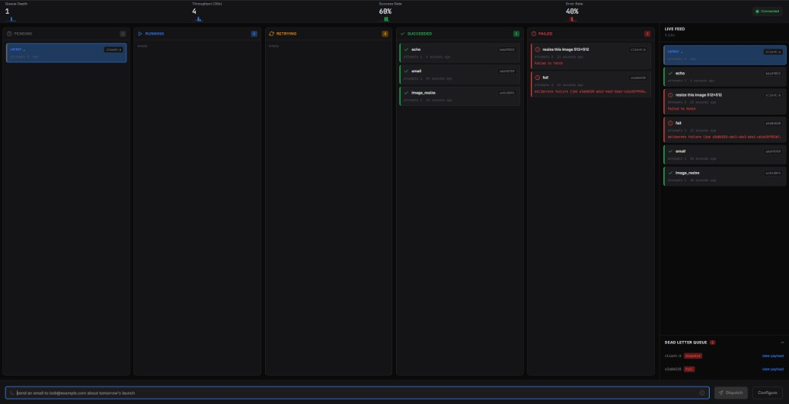
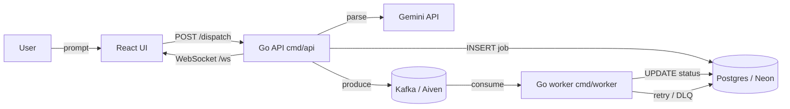

# Flowbit

A distributed task queue built from scratch in Go (Kafka + Postgres), with a Gemini dispatcher that turns plain English into jobs and a live React pipeline visualizer.

[](https://github.com/dna737/flowbit/actions/workflows/deploy.yml)

> **Live demo:** _coming soon_



## What it does

- **Plain English in, structured job out.** `POST /dispatch` with `"send an email to bob@example.com about tomorrow's launch"` and Gemini returns a typed job (`job_type`, `parameters`).
- **Durable queue.** Job state lives in Postgres (Neon); Kafka (Aiven) carries the work. Crash a worker mid-job and the next consumer picks it up.
- **Retries + dead-letter queue.** Up to 3 attempts with exponential backoff on Kafka read errors; final failures land in `dead_letter_queue` and stay there.
- **Live pipeline view.** The React UI subscribes over WebSocket and animates each job through `pending → running → retrying → succeeded / failed`, with a metrics strip and a DLQ panel.
- **Pluggable handlers.** `echo`, `email`, `image_resize` ship as job types; `fail` is built in for chaos testing the retry/DLQ paths.

## Architecture



The API and worker are separate binaries (`backend/cmd/api`, `backend/cmd/worker`). The API is stateless and Cloud Run-friendly; the worker is a steady consumer that should run on a long-lived host. See [docs/10-architecture.md](docs/10-architecture.md) for the layer breakdown.

## AI dispatcher

`POST /dispatch` calls Gemini with the user prompt and asks for structured output. The default model is `gemini-3-flash-preview`; on 5xx/429 the dispatcher walks a fallback chain (`gemini-flash-latest`, `gemini-2.5-flash`, `gemini-2.5-pro`, `gemini-2.0-flash`, `gemini-2.0-flash-lite`) configured in [.env.example](.env.example).

Real Gemini traffic from a demo session, observed in Google AI Studio:


Validated output is forwarded to `POST /jobs`, which is the same shape you'd post directly without the AI layer — the scheduler stays runnable and testable without Gemini configured.

## Tech stack

- **Backend:** Go 1.24+, [`segmentio/kafka-go`](https://github.com/segmentio/kafka-go), [`jackc/pgx`](https://github.com/jackc/pgx), `gorilla/websocket`
- **Data plane:** Postgres (Neon, free tier), Kafka with TLS cert auth (Aiven, free tier)
- **AI:** Google Gemini via Google AI Studio
- **Frontend:** React 18 + TypeScript + Vite + MUI
- **Deploy targets:** Cloud Run (API), Compute Engine `e2-micro` or similar (worker), Vercel/Firebase Hosting (UI)

## Run it locally

You need:

- Go 1.24+, Node 20+
- A Neon Postgres URL
- Aiven Kafka brokers + `service.cert` / `service.key` / `ca.pem` in the repo root
- _(Optional)_ a Gemini API key for `/dispatch`

Set up env once:

```powershell
Copy-Item .env.example .env
# fill in DATABASE_URL, KAFKA_BROKERS, GEMINI_API_KEY
```

Verify connectivity:

```powershell
cd backend
go run ./cmd/smoke
```

Expect `smoke checks passed: postgres + kafka`.

Then start three processes in three terminals:

```powershell
# terminal 1 — API + WebSocket
cd backend ; go run ./cmd/api

# terminal 2 — worker
cd backend ; go run ./cmd/worker

# terminal 3 — UI
cd frontend ; npm install ; npm run dev
```

Open <http://localhost:5173>, type a prompt, and watch the board update.

To skip the UI and drive the API directly:

```powershell
curl -X POST http://localhost:8080/jobs `
  -H "Content-Type: application/json" `
  -H "X-User-Id: demo" `
  -d "{\"job_type\":\"echo\",\"parameters\":{\"message\":\"hello flowbit\"}}"

curl http://localhost:8080/jobs/<job-id>
```

`X-User-Id` selects the row in `users`; `job_type` must match a label in that user's `dispatch_categories` (editable from the Settings dialog in the UI or via `PUT /settings/dispatch-categories`).

## Tests

From `backend/`:

```powershell
go test ./...
```

Unit-only — HTTP handlers with fakes, repo with pgxmock, worker job logic, Kafka TLS defaults. No cloud credentials required.

<details>
<summary>Optional: Postgres integration test (Docker)</summary>

Spins up Postgres via Testcontainers, applies the schema, and round-trips `CreateJob` / `GetJobByID`.

```powershell
cd backend
$env:INTEGRATION=1
go test -tags=integration -v ./integration/...
```

</details>

<details>
<summary>Optional: full managed-stack E2E (Neon + Kafka + worker)</summary>

Uses the same `.env` as smoke. Creates a `general` job, publishes to Kafka, consumes with a one-off group at `LastOffset`, runs `worker.HandleJob`, asserts `succeeded`.

```powershell
cd backend
$env:E2E_STACK = "1"
go test -tags=e2e -count=1 ./integration -run TestStack_genericJob_endToEnd -v
```

Skipped when `E2E_STACK` is unset, so `go test ./...` stays credential-free.

</details>

## Deploy

The API ships as a distroless container built from the root [Dockerfile](backend/Dockerfile) and is designed for Cloud Run. The worker runs alongside on a long-lived host because Cloud Run scales to zero.

Full wiring (env vars, Secret Manager mounts for Aiven TLS, migration policy, WebSocket caveat, local Docker verify): [docs/deploy.md](docs/deploy.md).

## Repository layout

```
backend/
  cmd/{api,worker,smoke}    # binaries
  internal/                 # api, dispatcher, kafka, queue, worker, repo, realtime, ...
  integration/              # Testcontainers + managed-stack E2E
frontend/
  src/{components,hooks,jobs,api}
docs/
  00-vision-and-demo.md  10-architecture.md  20-stack-and-deployment.md
  30-scheduler.md  40-ai-dispatcher.md  50-visualizer.md
  60-observability-and-runbook.md  90-study-guide.md
  deploy.md  BUILD-CHECKLIST.md
```

## Further reading

- [Vision and demo](docs/00-vision-and-demo.md)
- [Architecture](docs/10-architecture.md)
- [Scheduler internals](docs/30-scheduler.md) — retries, backoff, DLQ
- [AI dispatcher](docs/40-ai-dispatcher.md)
- [Visualizer](docs/50-visualizer.md)
- [Observability + runbook](docs/60-observability-and-runbook.md)
- [Build checklist](docs/BUILD-CHECKLIST.md)
- [Contributing](CONTRIBUTING.md)
